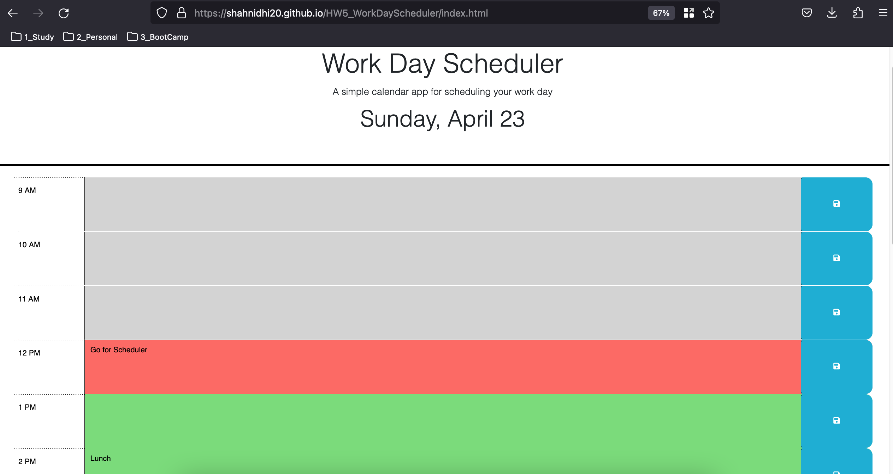

# 05 Third-Party APIs: Work Day Scheduler

     
   

## Description

A simple calendar application that allows a user to save events for each hour of the day. This app will run in the browser and feature dynamically updated HTML and CSS powered by jQuery.

It also demonstrates the use of [Day.js](https://day.js.org/en/) library to work with date and time.

### Dependencies

NA

### Installing

- Clone the repo

### Depolyed URL

https://shahnidhi20.github.io/HW5_WorkDayScheduler/index.html

### Executing program

NA

## Help

NA

## Authors

Nidhi Shah

## Version History

    0.1
        Initial Release

## License

NA

## Acknowledgments

    Refered following resources
    https://www.w3schools.com/js/
    https://developer.mozilla.org/en-US/docs/Web/JavaScript
    https://day.js.org/
    https://jquery.com/
